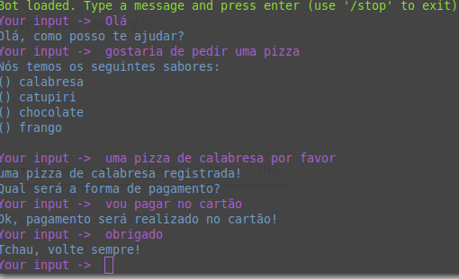

# Chatbot
Chatbot feito utilizando o framework rasa

## Requisitos
- Python3
- rasa library

## Instalação

A instalação do python pode ser feita no site:
https://www.python.org/downloads/

ou se estiver no linux:

```bash
sudo apt install python3
sudo apt install python3-pip
```
Instalando o Rasa

```bash
pip3 install rasa-x --extra-index-url https://pypi.rasa.com/simple
```

Instalando o Spacy

```bash
pip3 install rasa[spacy]
python -m spacy download pt_core_news_sm
python -m spacy link pt_core_news_sm pt
```
## Execução

Após a instalação das dependências, é necessário executar o servidor das actions, que é onde o rasa fará a requisição para ações customizadas, para isso execute o comando: 

```bash
python -m rasa_sdk --actions actions
```

Isso irá executar um servidor no "http://localhost:5055/webhook" que foi configurado no arquivo endpoints.yml

Com isso, agora é só executar:

```bash
rasa shell
```

Assim o rasa pegará o último modelo treinado disposto na pasta models/, e será possível conversar com o bot


